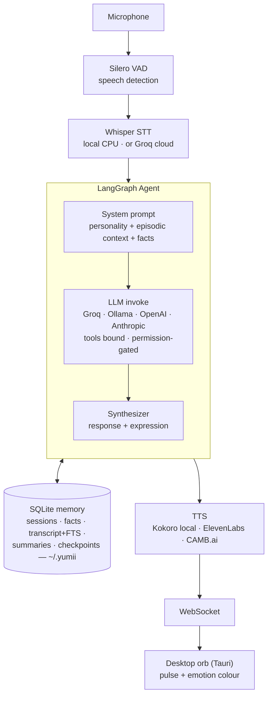

# Yumii — the AI companion that's actually yours

[](CHANGELOG.md)
[](https://python.org)
[](https://tauri.app/)
[](#)
[](LICENSE)
[](https://github.com/CodeNeuron58/Yumii)

> ### She helps you do things — and helps you *through* things.

Yumii is an open-source AI companion that lives on your desktop — a floating
orb you **talk to out loud, in real time**. She helps you **do things**
(search the web, your email, your calendar), and she's honestly there when
**things are hard** — not the empty validation of a chatbot, but grounded,
real support. She remembers your life together, and she runs entirely on
**your** machine: no account, no cloud, nothing ever leaves your computer.

<!-- Demo placeholder: a 15–20s screen recording goes here — you speak, the
     orb reacts, she answers out loud, you switch her personality. -->
<p align="center"><em>Demo coming soon.</em></p>

> **Experimental preview.** The real-time voice loop, personalities,
> persistent memory, and permission-gated tools all work end-to-end.
> Windows-first for now; expect rough edges. See
> [`CHANGELOG.md`](CHANGELOG.md) and [`ROADMAP.md`](ROADMAP.md).

---

## Install (one command)

**Windows** (PowerShell):

```powershell
iex (irm https://yumii.me/install.ps1)
```

That's the whole install. It sets up [uv](https://docs.astral.sh/uv/), a
private Python 3.12, Yumii's backend, and the desktop app — then puts
**Yumii in your Start Menu**. The first time you open her, she downloads her
voice and ears (one-time), then asks for a **single API key** — a free
[Groq](https://console.groq.com) key is the easiest start (or
[Ollama](https://ollama.com)). Then just talk.

**Updating:** re-run the same command.

**macOS / Linux:** the desktop shell is Windows-first for now —
`curl -fsSL https://yumii.me/install.sh | bash` installs the backend for
development, and the native shells are on the [roadmap](#roadmap).

---

## What she does

- **Listens** — real-time speech, Silero VAD + Whisper (local or cloud), with
  barge-in you can talk over, like Gemini Live
- **Thinks** — Groq, Ollama Cloud, OpenAI, or Anthropic, with a persistent
  personality
- **Speaks** — Kokoro (fully local, free, no key) or ElevenLabs / CAMB.ai,
  streamed as she talks
- **Does things** — web search, plus Gmail, Google Calendar, and Notion via
  Composio, with **every action behind a permission gate**. These are the
  integrations for now — more are planned, including direct MCP and tool
  integrations.
- **Remembers** — searches every past conversation, writes and corrects her
  own facts about you, and knows *when* you last spoke and what happened
- **Reacts** — a floating orb that pulses and shifts colour with the
  conversation
- **Stays yours** — no account, no telemetry; API keys in an owner-only local
  file, memory in `~/.yumii/`

---

## Personalities

Pick a vibe. Each one is just a text prompt you can edit — or write your own:

- **Caring** — warm, empathetic, and supportive
- **Tsundere** — playful teasing with a soft heart
- **Genki** — energetic and cheerful
- **Kuudere** — cool, calm, and rational
- **Dandere** — shy and quietly kind
- **Yandere** — intensely devoted

---

## Providers

Everything is switchable from the in-app dashboard — mix local and cloud
however you like.

| Role | Options |
|------|---------|
| **Mind (LLM)** | Groq *(free tier)* · **Ollama Cloud** (minimax-m3, 1M context) · OpenAI · Anthropic |
| **Ears (STT)** | Local Whisper *(private, offline)* · Groq Whisper *(fast, cloud)* · Vosk *(offline streaming)* |
| **Voice (TTS)** | **Kokoro** *(local, free, recommended)* · ElevenLabs · CAMB.ai |

Want her **fully offline**? Local Whisper + Kokoro + a local Ollama, and
nothing leaves the machine at all.

---

## Run from source (developers)

Needs [uv](https://docs.astral.sh/uv/), Rust + MSVC C++ Build Tools (Windows);
WebView2 ships with Win 10/11.

```bash
git clone https://github.com/CodeNeuron58/Yumii.git
cd Yumii
uv sync

cd desktop && npx @tauri-apps/cli dev   # the desktop app — the only way to run Yumii
```

The shell starts the backend for you (`yumii server` is the headless launcher
it invokes — there is no interactive CLI and no browser UI).

> Use `uv`, **not** `pip` — dependencies are locked with uv and installed via
> `uv sync`.

---

## Roadmap

**Next up:**

- **Seeing your screen** — she can look at what you're looking at and help
  with it
- **Proactiveness** — she notices and speaks first, instead of only answering

**Later:**

- Direct MCP and tool integrations, beyond Composio
- macOS and Linux desktop shells
- More voices, personalities, and languages
- Deeper, honest emotional support grounded in real psychology
- **Live2D avatar mode** — the long-term dream; no timeline yet

---

## Architecture



---

## Private by architecture

Privacy isn't a setting here — it's the design:

- **No account, no server of ours, no telemetry.** Your data goes only to the
  LLM/STT/TTS providers *you* choose — or stays fully on-device with the
  local options.
- **API keys** live in `~/.yumii/auth.json` — owner-only permissions, atomic
  writes (the same model Claude Code and opencode use).
- **Memory** lives in `~/.yumii/` on your machine. Delete the folder and she
  forgets; back it up and she's portable.

---

## Contributing

Contributions are welcome — and the easiest one is genuinely tiny:

> **A new personality is a single `.txt` file** in
> [`src/yumii/assets/prompts/`](src/yumii/assets/prompts/). Copy one, rewrite
> the character, open a PR.

Other great starting points: new TTS/STT backends, more tools, or the
macOS/Linux shells. See [CONTRIBUTING.md](CONTRIBUTING.md).

---

## License

MIT — see [LICENSE](LICENSE). She's yours.
