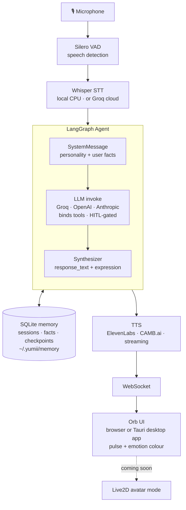

# Yumii 🌸 — Real-Time AI Companion

[](CHANGELOG.md)
[](https://python.org)
[](https://docs.astral.sh/uv/)
[](https://fastapi.tiangolo.com)
[](https://tauri.app/)
[](LICENSE)
[](https://github.com/CodeNeuron58/Yumii)

Yumii is an open-source, locally-runnable AI companion with real-time voice
conversation and expressive personality. She runs on a standard CPU — no
expensive GPU required.

> ⚠️ **This is v0.6.0 — an alpha release. No API stability promise yet.**
> The voice loop, six personalities, persistent memory, multi-session support,
> and tool-calling (with a human-in-the-loop confirmation gate) all work
> end-to-end.
>
> 🖥️ **Pivoting to a desktop app.** Yumii is moving from a browser page to a
> native **desktop app** (Tauri) with a small floating **orb** UI. The animated
> Live2D **companion/avatar is a planned "coming soon" mode**. The desktop app
> and the browser UI run the same Python brain. See
> [`CHANGELOG.md`](CHANGELOG.md) and [`ROADMAP.md`](ROADMAP.md).

---

## ⚡ Install (One Line)

**Windows (PowerShell):**
```powershell
irm https://raw.githubusercontent.com/CodeNeuron58/Yumii/master/install.ps1 | iex
```

**macOS / Linux:**
```bash
curl -LsSf https://raw.githubusercontent.com/CodeNeuron58/Yumii/master/install.sh | sh
```

**From source (developers):**
```bash
git clone https://github.com/CodeNeuron58/Yumii.git
cd Yumii
uv sync
```
Then either activate the virtual environment:
```bash
# Windows
.venv\Scripts\activate
yumii

# macOS / Linux
source .venv/bin/activate
yumii
```
Or skip activation and use:
```bash
uv run yumii
```

---

## ✨ What Yumii Does

- 🎙 **Listens** — picks up your voice using Silero VAD + Whisper (local or Groq cloud)
- 🧠 **Thinks** — responds via Groq, OpenAI, or Anthropic LLMs with a persistent personality
- 🛠 **Acts** — calls tools (time, web search) behind a human-in-the-loop confirmation gate
- 🗣 **Speaks** — synthesizes voice through ElevenLabs or CAMB.ai, streamed in real time
- 🟢 **Reacts** — a floating orb that pulses and shifts colour with the conversation (Live2D avatar mode coming soon)
- 🧠 **Remembers** — extracts and stores user facts in local SQLite, injects them into every session
- 💬 **Sessions** — multiple independent conversations with resume, rename, and delete
- 🔐 **Private** — API keys stored in `~/.yumii/auth.json`, an owner-only local file (the same model Claude Code and opencode use); never sent anywhere except your chosen provider

---

## 🚀 Quick Start

### 1. Prerequisites

- Python **3.12+**
- [`uv`](https://docs.astral.sh/uv/) (the project's package manager)

Install `uv` if you don't have it:
```bash
# macOS / Linux
curl -LsSf https://astral.sh/uv/install.sh | sh

# Windows (PowerShell)
powershell -c "irm https://astral.sh/uv/install.ps1 | iex"
```

### 2. Clone & Install

```bash
git clone https://github.com/CodeNeuron58/Yumii.git
cd Yumii
uv sync
```

> ⚠️ **Do NOT use `pip install`**. The project pins `torch` to a CPU-only wheel
> index. `pip` doesn't understand this and will try to download the full 2 GB
> CUDA build or fail outright. Always use `uv sync`.

### 3. The UI — Orb (today) · Avatar (coming soon)

The default interface is a lightweight **orb**: a floating circle that pulses
and shifts colour with the conversation. It needs no assets and works out of
the box.

The animated **Live2D companion/avatar is a planned "coming soon" mode** —
selecting it in the UI shows a placeholder for now. The previous Live2D UI is
preserved (but not shipped) as
[`_companion_live2d.reference.html`](src/yumii/assets/webui/_companion_live2d.reference.html)
for that future work, and user-supplied models will live in `~/.yumii/avatar/`.

Either way, **voice + LLM + personality + memory all work** — the UI is purely
how Yumii shows up on screen.

### 4. Configure Yumii

```bash
# Option A — activate venv (then use bare commands for the rest of the session)
.venv\Scripts\activate    # Windows
source .venv/bin/activate  # macOS / Linux
yumii

# Option B — no activation needed
uv run yumii
```

On first launch, an interactive wizard walks you through:

| Step | What it sets up |
|------|----------------|
| **Mind** | LLM provider (Groq / OpenAI / Anthropic) + API key |
| **Voice** | ElevenLabs API key + Voice ID |
| **Ears** | STT backend — Local Whisper (private, offline) or Groq Whisper (cloud, 5-10x faster) |
| **Personality** | Caring · Tsundere · Genki · Kuudere · Yandere · Dandere |

All API keys are saved to **`~/.yumii/auth.json`** — a local file with owner-only
permissions, created by the wizard. You can change any setting later via the
dashboard or by editing the file directly.

### 5. Wake Up

```bash
# If venv is activated
yumii

# Without activation
uv run yumii
```

Select **🌸 Wake Yumii Up** (or run `yumii wake-up`). Your browser opens
automatically to the orb UI — **tap the orb**, allow microphone access, and
start talking.

**Prefer the desktop app?** (early — runs from source; needs Rust + the MSVC C++
Build Tools on Windows, WebView2 is preinstalled on Win 10/11):
```bash
cd desktop
cargo tauri dev        # or: npx @tauri-apps/cli dev
```
This opens Yumii as a frameless floating orb window and starts the backend for you.

You can also manage sessions and memory directly from the CLI **before** waking Yumii up:

| Command | What it does |
|---------|-------------|
| `/chat` | Browse, resume, or delete past sessions |
| `/resume` | Resume your most recent session |
| `/sessions` | List all saved sessions |
| `/memory` | Browse and edit what Yumii remembers about you |
| `/forget` | Wipe all long-term memory (keeps sessions) |
| `/name <name>` | Rename the active session |

---

## 🎛 STT Backends

| Backend | Privacy | Speed | Requirements |
|---------|---------|-------|-------------|
| **Local Whisper** *(default)* | ✅ Fully local | ~1-2s per sentence | None |
| **Groq Whisper** | ☁️ Cloud | ~100-300ms per sentence | Free Groq API key |

Switch backends anytime via ⚙️ Configure Senses → Listening Settings.

For **Groq Whisper**: if you've already configured Groq as your LLM provider,
Yumii will reuse the same API key — no duplicate entry needed.

---

## 🤖 LLM Providers

| Provider | Model | Notes |
|----------|-------|-------|
| **Groq** *(recommended)* | llama-3.3-70b-versatile | Fastest inference, free tier |
| **OpenAI** | gpt-4o | Most capable |
| **Anthropic** | claude-3-5-sonnet | Most nuanced |

---

## 🏗 Architecture



---

## 📁 Project Structure

```
src/yumii/
  agent/          # LangGraph state machine, LLM agent, personality manager
                  #   graph.py      → agent → tools → agent loop, AsyncSqliteSaver checkpoints
                  #   llm.py        → tool-bound LLM factory with fact injection
                  #   nodes.py      → personality-switch detector
                  #   synthesizer.py→ heuristic emotion/motion classifier
                  #   fact_extractor.py → Automatic user-fact extraction
  api/            # FastAPI server, WebSocket, REST endpoints
                  #   server.py     → /health, /api/sessions, /api/facts, /ws
  audio/          # STT pipeline (Silero VAD + Whisper/Groq)
  core/           # Pydantic settings, auth.json credential store, engine orchestrator
                  #   engine.py     → Session lifecycle + command interception
                  #   memory_db.py  → Low-level SQLite schema
                  #   memory_manager.py → Fact CRUD + extraction trigger
                  #   session_manager.py  → Session CRUD
  tts/            # ElevenLabs TTS + CAMB.ai streaming TTS
  tools/          # LangChain tools + registry/policy (time, web search, MCP loader)
  assets/
    prompts/      # Personality prompt files (.txt)
    webui/        # index.html (orb) + _companion_live2d.reference.html (archived)
  cli.py          # Typer CLI entry point (yumii command)

desktop/
  src-tauri/      # Tauri v2 Rust app: main.rs (window, tray, hotkey, Python sidecar),
                  # tauri.conf.json, Cargo.toml, capabilities/, icons/
```

> **Avatar files** go in `~/.yumii/avatar/` (user-provided, not bundled).
> **Memory database** lives at `~/.yumii/memory/yumii.db` (auto-created).

---

## 🔐 Security

Yumii keeps secrets and preferences in two separate local files, and nothing
ever leaves your machine except calls to the providers you configured:

- **`~/.yumii/auth.json`** — API keys. Created with owner-only permissions
  (0600) and written atomically by
  [`credential_store.py`](src/yumii/core/credential_store.py). This is the
  same storage model Claude Code and opencode use.
- **`~/.yumii/config.json`** — non-sensitive preferences (personality,
  provider choice, model sizes).

Upgrading from an older version that used the OS keychain? Your keys are
migrated to `auth.json` automatically on first run.

---

## 🤝 Contributing

Contributions are welcome! See [CONTRIBUTING.md](CONTRIBUTING.md) for setup instructions.

Ideas for contributions:
- New personality prompts
- Additional LangChain tools (weather, reminders, etc.)
- Alternative TTS backends (Kokoro, system TTS)
- UI/avatar improvements
- Performance optimizations

---

## 📄 License

MIT — see [LICENSE](LICENSE).
