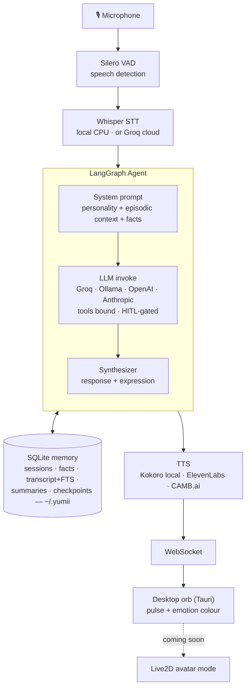

# Yumii 🌸 — An AI Companion for Your Desktop

[](CHANGELOG.md)
[](https://python.org)
[](https://docs.astral.sh/uv/)
[](https://fastapi.tiangolo.com)
[](https://tauri.app/)
[](LICENSE)
[](https://github.com/CodeNeuron58/Yumi)

Yumii is an open-source AI companion that lives on your desktop — a floating
orb you talk to, with real-time voice, six personalities, and a memory of
your life together that stays in a file on your machine. Runs on a normal
CPU, no GPU needed.

> ⚠️ **Alpha — no API stability promise yet.** The voice loop, personalities,
> persistent memory (recall of any past conversation, self-written facts,
> session summaries with time sense), and tool-calling behind a
> human-in-the-loop gate all work end-to-end. The animated Live2D avatar is a
> planned "coming soon" mode. See [`CHANGELOG.md`](CHANGELOG.md) and
> [`ROADMAP.md`](ROADMAP.md).

---

## ⚡ Install (one command)

**Windows** (PowerShell):

```powershell
iex (irm https://yumii.me/install.ps1)
```

That's the whole install. It sets up [uv](https://docs.astral.sh/uv/), a
private Python 3.12, Yumii's backend, and the desktop app — then puts
**Yumii in your Start Menu**. Open her, paste one API key in the ⚙️ dashboard
(a free [Groq](https://console.groq.com) key is plenty, or an
[Ollama](https://ollama.com) key), and start talking. Her local voice model
downloads itself the first time she speaks.

**Updating:** re-run the same command.

**macOS / Linux:** the desktop shell is Windows-first for now —
`curl -fsSL https://yumii.me/install.sh | bash` installs the backend for
development, and the native shells are on the roadmap.

---

## ✨ What Yumii Does

- 🎙 **Listens** — Silero VAD + Whisper (local or Groq cloud), with a manual mic mute
- 🧠 **Thinks** — Groq, Ollama Cloud, OpenAI, or Anthropic, with a persistent personality
- 🗣 **Speaks** — Kokoro (fully local, no API key) or ElevenLabs / CAMB.ai, streamed in real time
- 🛠 **Acts** — tools (web search, Gmail/Calendar/Notion via Composio) behind a permission gate
- 🧠 **Remembers** — searches every past conversation (local FTS), writes and corrects her own
  facts, and knows *when* you last spoke and what happened — all in local SQLite
- 🟢 **Reacts** — a floating orb that pulses and shifts colour with the conversation
  (Live2D avatar mode coming soon)
- 🔐 **Private by architecture** — no account, no server, nothing phones home; API keys
  live in an owner-only local file, memory lives in `~/.yumii/`

---

## 🛠 Run From Source (developers)

Needs [uv](https://docs.astral.sh/uv/), Rust + MSVC C++ Build Tools (Windows);
WebView2 ships with Win 10/11.

```bash
git clone https://github.com/CodeNeuron58/Yumi.git
cd Yumi
uv sync

cd desktop && npx @tauri-apps/cli dev   # the desktop app — the only way to run Yumii
```

The shell starts the backend for you (`yumii server` is the headless
launcher it invokes — there is no interactive CLI and no browser UI).

> ⚠️ Use `uv`, **not** `pip` — dependencies are locked with uv and installed
> via `uv sync`.

---

## 🤖 Providers

| Role | Options |
|------|---------|
| **Mind (LLM)** | Groq *(free tier)* · **Ollama Cloud** (minimax-m3, 1M context) · OpenAI · Anthropic |
| **Ears (STT)** | Local Whisper *(private, offline)* · Groq Whisper *(fast, cloud)* · Vosk *(offline streaming)* |
| **Voice (TTS)** | **Kokoro** *(local, free, recommended)* · ElevenLabs · CAMB.ai |

Everything is switchable from the in-app ⚙️ dashboard.

---

## 🏗 Architecture



---

## 📁 Project Structure

```
src/yumii/
  agent/          # LangGraph state machine, tool-bound LLM, personality manager,
                  # emotion synthesizer, fact extraction + memory review
  api/            # FastAPI server: /health, /ws, REST, /dashboard.html
  audio/          # STT pipeline (Silero VAD + Whisper/Groq/Vosk)
  core/           # settings, auth.json credential store, engine orchestrator,
                  # SQLite memory (facts, transcript+FTS, session summaries)
  tts/            # Kokoro (local ONNX) + ElevenLabs + CAMB.ai streaming
  tools/          # tool registry + policies: web search, recall, memory,
                  # Composio integrations
  assets/         # personality prompts, orb + dashboard pages, Silero model
  cli.py          # bare launcher: `yumii server` (the shell invokes this)

desktop/
  src-tauri/      # Tauri v2 shell: orb window, tray, global hotkey,
                  # backend launcher
```

> **Memory** lives at `~/.yumii/memory/` (auto-created). **API keys** at
> `~/.yumii/auth.json`.

---

## 🔐 Security

- **`~/.yumii/auth.json`** — API keys, owner-only permissions, atomic writes
  (the same storage model Claude Code and opencode use).
- **`~/.yumii/config.json`** — non-sensitive preferences.
- No accounts, no telemetry, no server of ours: your data goes only to the
  LLM/STT/TTS providers *you* configure — or stays fully on-device with the
  local options.

---

## 🤝 Contributing

Contributions are welcome! See [CONTRIBUTING.md](CONTRIBUTING.md).

Ideas: new personality prompts, more tools, TTS backends, the Live2D avatar
mode, macOS/Linux desktop shells.

---

## 📄 License

MIT — see [LICENSE](LICENSE).
